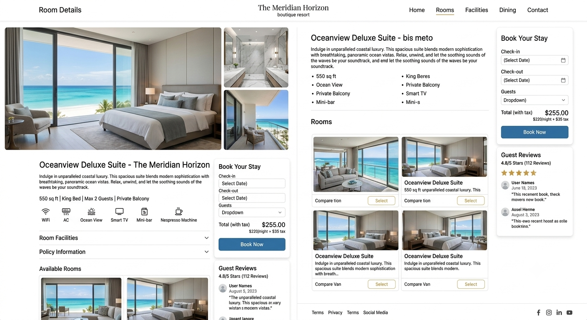

# React + Vite

This template provides a minimal setup to get React working in Vite with HMR and some ESLint rules.

Currently, two official plugins are available:

- [@vitejs/plugin-react](https://github.com/vitejs/vite-plugin-react/blob/main/packages/plugin-react) uses [Oxc](https://oxc.rs)
- [@vitejs/plugin-react-swc](https://github.com/vitejs/vite-plugin-react/blob/main/packages/plugin-react-swc) uses [SWC](https://swc.rs/)

## React Compiler

The React Compiler is not enabled on this template because of its impact on dev & build performances. To add it, see [this documentation](https://react.dev/learn/react-compiler/installation).

## Expanding the ESLint configuration

If you are developing a production application, we recommend using TypeScript with type-aware lint rules enabled. Check out the [TS template](https://github.com/vitejs/vite/tree/main/packages/create-vite/template-react-ts) for information on how to integrate TypeScript and [`typescript-eslint`](https://typescript-eslint.io) in your project.

# historical data of user
# review has seperate model for rooms and hotel
# seperate model for hotel and room but room can connected with hotel id.
# am creating a a web application for hotel rooms boooking , only for one   hotel buta that hotle has lots of branch in different cityes , so now am creating a api for that but am not getting how many model i have to create menas in db has seperate room collection and hotel , and if i do then how to link both and what is the key in both 

1. What is AWS?

Answer:
AWS (Amazon Web Services) is a cloud computing platform that provides services like computing, storage, databases, networking, security, AI, and analytics on a pay-as-you-go model.

2. What are the main cloud service models?

Answer:

IaaS (Infrastructure as a Service) – EC2
PaaS (Platform as a Service) – Elastic Beanstalk
SaaS (Software as a Service) – Amazon WorkMail
3. What are AWS Regions?

Answer:
Regions are separate geographical locations where AWS has data centers. Each region contains multiple Availability Zones.

4. What are Availability Zones (AZs)?

Answer:
Availability Zones are isolated data centers within a region that provide high availability and fault tolerance.

5. What is EC2?

Answer:
Amazon EC2 (Elastic Compute Cloud) is a virtual server that allows users to run applications in the cloud.

6. What are EC2 Instance Types?

Answer:

General Purpose
Compute Optimized
Memory Optimized
Storage Optimized
GPU Instances
7. What is Amazon S3?

Answer:
Amazon S3 is an object storage service used to store files, backups, images, videos, and static website content.

8. What are S3 Storage Classes?

Answer:

Standard
Intelligent-Tiering
Standard-IA
One Zone-IA
Glacier Instant Retrieval
Glacier Flexible Retrieval
Glacier Deep Archive
9. What is EBS?

Answer:
Elastic Block Store is block-level storage attached to EC2 instances.

10. Difference between EBS and S3?
EBS	S3
Block Storage	Object Storage
Attached to EC2	Accessible over internet
Low latency	High durability
11. What is IAM?

Answer:
Identity and Access Management allows secure access to AWS resources using users, groups, roles, and policies.

12. What is an IAM Role?

Answer:
A role provides temporary permissions to AWS services without using access keys.

13. What is a Security Group?

Answer:
A Security Group acts as a virtual firewall for EC2 instances.

14. What is a Network ACL?

Answer:
A Network ACL controls inbound and outbound traffic at the subnet level.

15. Difference between Security Group and NACL?
Security Group	NACL
Instance level	Subnet level
Stateful	Stateless
16. What is VPC?

Answer:
Virtual Private Cloud is a logically isolated network in AWS.

17. What is a Subnet?

Answer:
A subnet is a range of IP addresses within a VPC.

18. What is an Internet Gateway?

Answer:
It enables communication between a VPC and the internet.

19. What is a NAT Gateway?

Answer:
Allows private subnet instances to access the internet without exposing them to inbound traffic.

20. What is Route Table?

Answer:
A route table contains rules that determine where network traffic is directed.

21. What is Elastic IP?

Answer:
A static public IPv4 address assigned to an EC2 instance.

22. What is Auto Scaling?

Answer:
Automatically increases or decreases EC2 instances based on traffic.

23. What is Elastic Load Balancer?

Answer:
Distributes incoming traffic across multiple EC2 instances.

24. Types of Load Balancer?

Answer:

Application Load Balancer (ALB)
Network Load Balancer (NLB)
Gateway Load Balancer (GWLB)
25. What is Route 53?

Answer:
AWS DNS service used for domain registration and routing internet traffic.

26. What is CloudWatch?

Answer:
Monitoring service for AWS resources and applications.

27. What are CloudWatch Alarms?

Answer:
They trigger notifications or actions when a metric reaches a defined threshold.

28. What is CloudTrail?

Answer:
Records AWS account activity and API calls for auditing.

29. What is SNS?

Answer:
Simple Notification Service sends messages using Email, SMS, Lambda, or HTTP.

30. What is SQS?

Answer:
Simple Queue Service stores messages between distributed applications.

31. Difference between SNS and SQS?
SNS	SQS
Push	Pull
Multiple Subscribers	One Consumer at a time
32. What is Lambda?

Answer:
AWS Lambda runs code without managing servers.

33. Benefits of Lambda?

Answer:

Serverless
Auto Scaling
Pay per execution
No server management
34. What is API Gateway?

Answer:
A managed service to create, publish, and secure REST or HTTP APIs.

35. What is RDS?

Answer:
Relational Database Service manages databases like MySQL, PostgreSQL, Oracle, SQL Server, and MariaDB.

36. What is DynamoDB?

Answer:
A fully managed NoSQL database with low latency and automatic scaling.

37. Difference between RDS and DynamoDB?
RDS	DynamoDB
SQL	NoSQL
Fixed Schema	Flexible Schema
38. What is Elastic Beanstalk?

Answer:
A Platform as a Service (PaaS) that deploys applications automatically.

39. What is CloudFormation?

Answer:
Infrastructure as Code service for creating AWS resources using templates.

40. What is AWS Elastic Cache?

Answer:
A managed Redis or Memcached service for caching frequently accessed data.

41. What is AWS Organizations?

Answer:
Used to manage multiple AWS accounts centrally.

42. What is KMS?

Answer:
Key Management Service securely creates and manages encryption keys.

43. What is Secrets Manager?

Answer:
Stores and rotates passwords, API keys, and database credentials securely.

44. What is ECR?

Answer:
Elastic Container Registry stores Docker container images.

45. What is ECS?

Answer:
Elastic Container Service runs Docker containers without managing Kubernetes.

46. What is EKS?

Answer:
Elastic Kubernetes Service is a managed Kubernetes platform.

47. What is AWS CLI?

Answer:
Command Line Interface to manage AWS services using terminal commands.

Example:

aws s3 ls
48. What is the AWS Shared Responsibility Model?

Answer:

AWS is responsible for:

Physical security
Hardware
Networking
Infrastructure

Customer is responsible for:

IAM
Data
Operating System
Applications
Security Groups
49. How do you secure an EC2 instance?

Answer:

Use IAM Roles
Configure Security Groups
Disable root login
Enable encryption
Keep OS updated
Use key pairs instead of passwords
Enable CloudWatch monitoring
50. Explain a simple AWS architecture for a web application.

Answer:
A common architecture includes:

Route 53 for DNS.
Application Load Balancer (ALB) to distribute incoming traffic.
EC2 instances running the application in multiple Availability Zones.
Auto Scaling to add or remove EC2 instances based on demand.
RDS for the relational database.
S3 for storing static files such as images and backups.
CloudWatch for monitoring and alerts.
IAM to control secure access to AWS resources.
Interview Tips
Be able to explain EC2, S3, IAM, VPC, RDS, Lambda, CloudWatch, Auto Scaling, Load Balancer, and Route 53 clearly, as these are among the most frequently discussed services.
Understand the differences between commonly compared services, such as S3 vs. EBS, RDS vs. DynamoDB, Security Groups vs. NACLs, and SNS vs. SQS.
If you're interviewing for a developer role, be prepared to describe how you've used AWS services in your own projects—for example, hosting applications on EC2, storing files in S3, or using RDS as a backend database.
